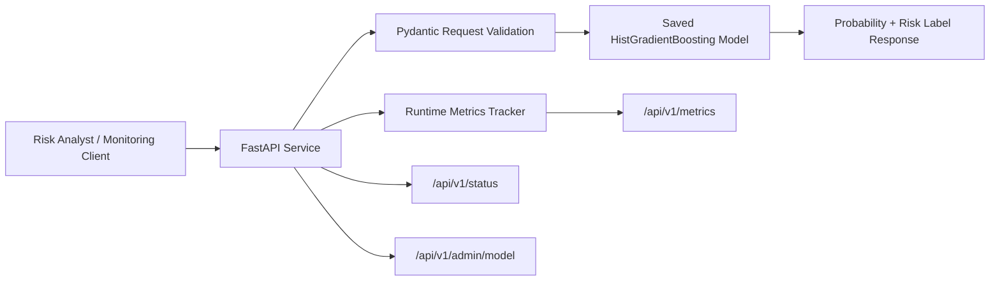
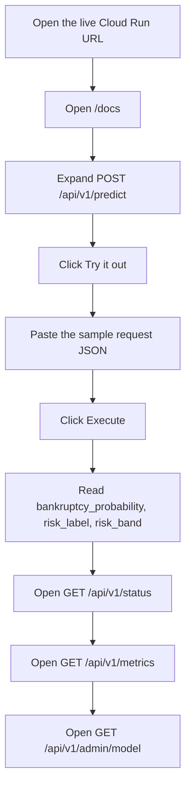

# Bankruptcy Risk Modeling API

This project implements Assignment 2 Part B as a production-style machine learning API. The chosen prediction task is `Risk Modeling`, using the professor-aligned Kaggle `Company Bankruptcy Prediction` dataset. The service trains a binary classifier, exposes a FastAPI `/docs` interface, validates input with Pydantic, tracks runtime metrics, and is packaged for Docker and Google Cloud Run deployment.

## Why This Direction

Part A was completed as a secure ML API with `predict`, `status`, and admin-oriented operations. For Part B, the assignment only allows a smaller set of tasks, so this implementation keeps the same API engineering discipline while switching the prediction problem to an allowed task: company bankruptcy risk scoring.

The final model uses `HistGradientBoostingClassifier` because it gave the best probability quality during local benchmarking across the tested options. The deployed decision threshold is set to `0.08` to bias the service slightly toward catching risky companies instead of optimizing raw accuracy.

## Users

- `Credit risk analysts` use the API for synchronous, single-company checks during underwriting reviews.
- `Portfolio monitoring services` call the API in batch-style workflows to rescore companies across a watchlist.
- `MLOps / platform admins` monitor model health, runtime metrics, and model metadata.

Expected daily volume: `2,000 requests/day`

User requirements:

- Real-time JSON scoring for individual companies.
- Stable schema with strict input validation.
- Probability output, not just a hard class label.
- Visibility into model version, threshold, and API health.

## Dataset

- Dataset: `Company Bankruptcy Prediction`
- Source: [Kaggle dataset page](https://www.kaggle.com/datasets/fedesoriano/company-bankruptcy-prediction/data)
- Local file used by the training script: `kaggle_dataset.csv`
- Rows: `6,819`
- Features: `95`
- Positive class rate: `3.23%`

## Model Results

Held-out test metrics from the saved artifact:

- `ROC-AUC`: `0.9597`
- `PR-AUC`: `0.5294`
- `F1`: `0.4842`
- `Precision`: `0.4510`
- `Recall`: `0.5227`
- `Log Loss`: `0.0995`
- `Brier Score`: `0.0222`

Why these metrics:

- `Accuracy` is not reported as the primary metric because the dataset is heavily imbalanced.
- `ROC-AUC` and `PR-AUC` show ranking quality.
- `Log Loss` and `Brier Score` show probability quality.
- `Precision`, `Recall`, and `F1` show the operational effect of the chosen threshold.

## API Performance

Local measurements from 30 live `/api/v1/predict` requests against the saved model:

- Average response time: `9.237 ms`
- p95 response time: `15.942 ms`
- Min response time: `4.903 ms`
- Max response time: `26.095 ms`
- Runtime memory observed by the API: `161.23 MB` to `162.83 MB`

The service also exposes live runtime metrics at `/api/v1/metrics`.

## Architecture



## Live Deployment

The current deployed Cloud Run version is publicly available here:

- Base URL: [https://assignment-2-cloud-run-1095831070964.us-central1.run.app](https://assignment-2-cloud-run-1095831070964.us-central1.run.app)
- Interactive API docs: [https://assignment-2-cloud-run-1095831070964.us-central1.run.app/docs](https://assignment-2-cloud-run-1095831070964.us-central1.run.app/docs)
- Status endpoint: [https://assignment-2-cloud-run-1095831070964.us-central1.run.app/api/v1/status](https://assignment-2-cloud-run-1095831070964.us-central1.run.app/api/v1/status)
- Metrics endpoint: [https://assignment-2-cloud-run-1095831070964.us-central1.run.app/api/v1/metrics](https://assignment-2-cloud-run-1095831070964.us-central1.run.app/api/v1/metrics)
- Model metadata endpoint: [https://assignment-2-cloud-run-1095831070964.us-central1.run.app/api/v1/admin/model](https://assignment-2-cloud-run-1095831070964.us-central1.run.app/api/v1/admin/model)

## How a New User Can Try the API




Quick reviewer steps:

1. Open the live docs page.
2. Expand `POST /api/v1/predict`.
3. Copy the sample payload from `artifacts/sample_request.json`.
4. Paste it into the request body and click `Execute`.
5. Review the returned prediction output.
6. Open `GET /api/v1/status` to confirm the service is healthy.
7. Open `GET /api/v1/metrics` to inspect runtime monitoring data.
8. Open `GET /api/v1/admin/model` to inspect the deployed model metadata.

## Repository Layout

```text
app/                   FastAPI application code
artifacts/             Trained model, metadata, and sample payload
deployment/            Deployment environment templates
reports/figures/       Evaluation plots for the report/video
scripts/train_model.py Training pipeline
tests/                 API tests
Dockerfile             Container build
README.md              Setup, architecture, and deployment guide
```

## Endpoints

- `POST /api/v1/predict`
- `GET /api/v1/status`
- `GET /api/v1/metrics`
- `GET /api/v1/schema/input`
- `GET /api/v1/admin/model`
- `POST /api/v1/admin/reload`
- `GET /docs`

Prediction response fields:

- `bankruptcy_probability`
- `risk_label`
- `risk_band`
- `decision_threshold`
- `model_version`
- `processing_time_ms`

## Local Setup

```bash
python3 -m venv .venv
source .venv/bin/activate
pip install -r requirements.txt
python scripts/train_model.py
uvicorn app.main:app --host 127.0.0.1 --port 8000
```

Open the auto-generated docs at [http://127.0.0.1:8000/docs](http://127.0.0.1:8000/docs).

## Example Usage

Use the generated sample payload:

```bash
curl -X POST "http://127.0.0.1:8000/api/v1/predict" \
  -H "Content-Type: application/json" \
  --data @artifacts/sample_request.json
```

Check status:

```bash
curl http://127.0.0.1:8000/api/v1/status
```

Check runtime metrics:

```bash
curl http://127.0.0.1:8000/api/v1/metrics
```

## Testing

```bash
pytest -q
```

Current local result: `3 passed`

## Docker

Build:

```bash
docker build -t bankruptcy-risk-api .
```

Run:

```bash
docker run --rm -p 8080:8080 \
  -e EXPECTED_DAILY_REQUESTS=2000 \
  -e ADMIN_TOKEN=change-me \
  bankruptcy-risk-api
```

Then open [http://127.0.0.1:8080/docs](http://127.0.0.1:8080/docs).

## Cloud Run Deployment

This repo includes a Dockerfile for the containerization requirement. For deployment to Cloud Run, the simplest production path is:

1. Set your Google Cloud project and region.
2. Build the image with Cloud Build.
3. Deploy the pushed image to Cloud Run.

Example:

```bash
export PROJECT_ID="your-project-id"
export REGION="northamerica-northeast1"
export IMAGE_URI="${REGION}-docker.pkg.dev/${PROJECT_ID}/assignment2/bankruptcy-risk-api:latest"

gcloud auth login
gcloud config set project "${PROJECT_ID}"
gcloud services enable run.googleapis.com artifactregistry.googleapis.com cloudbuild.googleapis.com
gcloud builds submit --tag "${IMAGE_URI}"
gcloud run deploy bankruptcy-risk-api \
  --image "${IMAGE_URI}" \
  --region "${REGION}" \
  --platform managed \
  --allow-unauthenticated \
  --set-env-vars EXPECTED_DAILY_REQUESTS=2000
```

Notes:

- Cloud Run injects the `PORT` environment variable automatically.
- If you want to use the admin reload endpoint, also set `ADMIN_TOKEN`.
- Cloud Run scales from zero, which matches the request-volume assumptions for this assignment.
- The deployment flow above follows Google Cloud's official guides for [building and pushing Docker images with Cloud Build](https://cloud.google.com/build/docs/build-push-docker-image) and [deploying container images to Cloud Run](https://cloud.google.com/run/docs/deploying).


## Deliverables in This Repo

- Trained model artifact: [artifacts/bankruptcy_risk_model.joblib](./artifacts/bankruptcy_risk_model.joblib)
- Model metadata: [artifacts/model_metadata.json](./artifacts/model_metadata.json)
- Sample request: [artifacts/sample_request.json](./artifacts/sample_request.json)
- ROC curve: [reports/figures/roc_curve.png](./reports/figures/roc_curve.png)
- Precision-recall curve: [reports/figures/precision_recall_curve.png](./reports/figures/precision_recall_curve.png)
- Confusion matrix: [reports/figures/confusion_matrix.png](./reports/figures/confusion_matrix.png)

Last verified deployment target: Google Cloud Run in `us-central1`.
